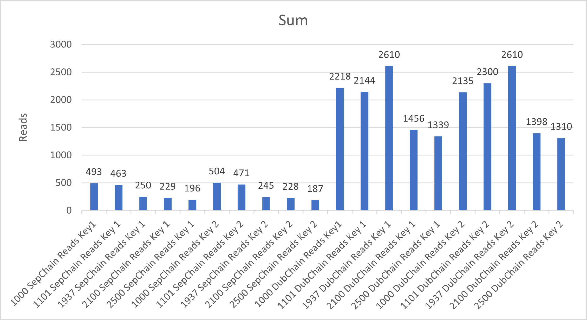
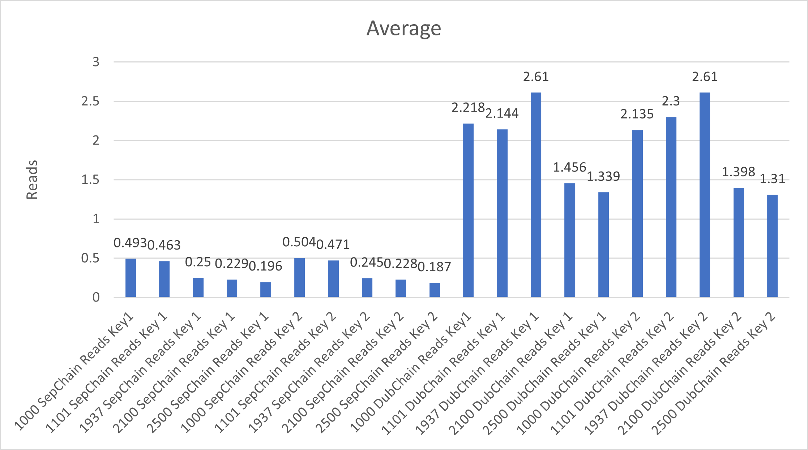

# CS 124 Project 5

For this project, you will hash the 1000+ objects from your data set. You will experiment to see what size hash table, collision detection method, and key work best for your data.

## Implement

### Setup
You will want to start at the end of Project 1. You should have a vector of 1000+ objects in your main function.
* You must use Separate Chaining.
* You must also choose any of the following open addressing methods (I recommend that you rename the LinearProbing class and modify it according to the method you chose):
  * Quadratic Probing
  * Exponential Probing
  * Double Hashing
  
  Hint: You should modify all three methods of the class (insert, find, and remove).

### Separate Chaining Class
Modify the insert method to count the number of reads of the hashed object.
* A read in this class is when you look at an item from the linked list, which appears as `*it` in the code.
  * Hint: the reads are not actually in the insert method, but in a method called from insert.

### Open Addressing Class
Modify the insert method to count the number of reads of the hashed object.
* A read in this class is when you look at one of the template objects from the table, which appears as `table[index].item` in the code.
  * Hint: the reads are not actually in the insert method, but in a method called from insert.

### Main File
You must create **two** different global functions in your main.cpp file that will be used as your getKey function in the hash tables.
* If you use the hornerHash algorithm from class, make sure your global functions take in an object of your class and return a unique string.
  * If you only have one unique field in your class, make each global function concatenate the unique field with another field.
* If you prefer, you can use a different hash function besides hornerHash. Make sure your keys are still unique for each object.

Create 10 separate-chaining hash table objects and 10 open addressing hash table objects of your custom data type.
* Half of the tables will use your first getKey function, half will use your second getKey function.
* You should use varying initial sizes for each of the five hash tables that use the same collision detection method and getKey function. 
  * The sizes should range from just bigger than the size of your data set to more than twice the size of your dataset, with at least two sizes being more than twice the size of your dataset.
  * Note that the hash table constructors will go to the next prime given the table size passed in, so you don't have to pass prime numbers to the constructors and your table sizes will always be prime.
* Using a single loop, insert all 1000+ objects into each of the 20 hash tables.
* For each object inserted in each of the 20 tables, record the number of hashed objects that were read. You should write this data out to file(s).
* For open addressing, print (cout) the size of the table after inserting all of 1000+  objects (because the table size may have changed in a rehash). You will need this info for the report.

## Extra Credit
For up to 10 points extra credit (at the grader’s discretion), you can:
* Use timers to see how long it takes you to insert/find elements in the hash tables.
* Use multiple types of open addressing and compare/analyze their read counts.
* Compare the runtimes with the time it takes to insert/find elements stored in other data structures (e.g. an unsorted vector, a sorted vector, a binary search tree, an AVL tree, a splay tree, a heap, etc.) The more structures you include, the better!

If you choose the extra credit option, clearly label the results and analysis in this section of your README.md file.

## Report
Include the following in this section of your README.md file:
* Information about your data set. You will be assigned a different grader for this project.

The data I used is statistics as well as other forms of information regarding the top 1000 Twitch streamers from 2020. The data itself is taken from Twitch but was uploaded and put together by a user on Kaggle. I used all the data provided in the making of this program. It was downloaded as an excel file but has since been changed into a CSV file for the purpose of this project. The fields within the program are as follows:

* name = a string which signifies the stage name of the streamer
* watchTime = a string; signifies total minutes consumers watched of the streamer
* streamTime = an integer which is total number of minutes streamed within the year
* peakViewers = an integer; highest concurrent view count
* averageViewers = an integer; average number of viewers per stream
* followers = an integer; total people following the streamers account
* followersGained = an integer that signifies number of followers gained over the time period
* viewsGained = an integer; total views gained compared to prior year
* partnered = a boolean; if the streamer is partnered with the Twitch service
* mature = a boolean that states the content rating; if it is mature or not
* language = a string that says the language spoken during the broadcast
* Entries are ordered in this order (descending).
* Peculiarities: watchTime was intended to be an integer. Due to the absurdly long nature of some of the statistics I had to convert these numbers to strings so as to be able to read them.

The reason I chose this data set is because I watch Twitch regularly and, I found it interesting to be able to see the stats of the top major streamers and be able to compare them.

* Create graphs for the number of reads for inserting your dataset into all 20 hash tables.
  * Clearly label the graph titles and axes.
  * You may want to graph the average number of reads per insertion, where the x-axis is the initial size of your hash table and the y-axis is the average read count. You can do this in two graphs (one for separate chaining and one for open addressing, where you'll have separate counts for each of the two getKey functions).

* Using the graphs, analyze how the number of reads change as the hash table size grows.
  * For the open addressing tables that have to rehash, you may also find it helpful to calculate the average reads excluding the one when the rehash takes place (for fairer comparison with the separate chaining tables).

Excluding the data where rehashing occurs, the number of reads goes down as the size of the table grows. This makes sense because the  more new spots the higher the likelihood that the index chosen will be open.

* Determine which getKey function works best on your dataset based on the read counts.

The average amount of iterations for my second key (using the watch time data) surprisingly produces less reads. My guess is due to their being more characters
in that data type rather than the twitch streamers names. The increased number of characters might provide a higher chance of creating a unique key. Although key 2 is slightly more efficient (a difference in averages of .001 for Separate chaining and .003 for Open Addressing)
I would use the name key as it provides a much easier read when you print out the table or are trying to look up a specific streamer. Having to associate the number of minutes watched is a lot less user-friendly than it is to search or remove a name.

* Draw conclusions about which hash collision detection method works best on your dataset (separate chaining or open addressing).

Separate chaining works a lot better for my data as it takes an enormous more reads to complete open addressing. Every open addressing hash table has to rehash and in-turn rebuild the table.
Having to rehash and rebuild the table is not something that effects the efficiency tremendously as we are using such a small amount of data. But, as more and more data gets inserted into our table this
will have a huge effect on how fast our code will be.

**Note: Any code that was not authored by yourself or the instructor must be cited in your report. This includes the use of concepts not taught in lecture.**

## Submit
You must include your source (all .cpp and .h) files, your data (.csv) file(s), your output file(s), CMakeLists.txt, and your updated README.md file that contains your report to your repository. Submit to Gradescope using the GitHub repository link, double-check that all the correct files are there, and wait for the autograder to provide feedback.

## Grading
The project is out of 70 points.

| Points Possible | Description of requirement                                                    |
|------------------- |-------------------------------------------------------------------------------|
| 5 pts | Program compiles and runs.                                                    |
| 5 pts | Code style. Readable, naming style is consistent, comments where appropriate. |
| 5 pts | Hashed at least 1000 objects using separate chaining.                         |
| 15 pts | Hashed at least 1000 objects using open addressing.                           |
| 5 pts | Used at least 5 different hash table sizes, as specified above.               |
| 5 pts | Used two getKey functions, as specified above.                                |
| 10 pts | Recorded the number of reads for each type of hashing.                        |
| 15 pts | Analyzed the results and wrote about everything outlined above.               |
| 5 pts | Report: professional, grammatically correct, cites sources.                   |